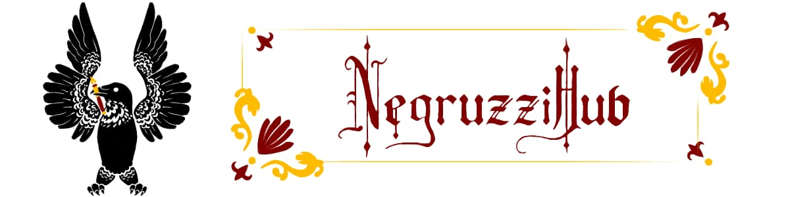
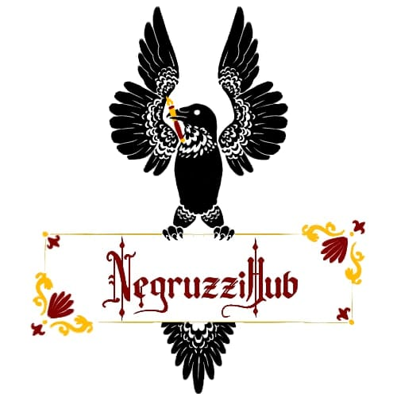

  

 

  

<h1 align="center">NegruzziHub</h1>

<em>The technology club of Colegiul Național "Costache Negruzzi" Iași.</em>

  <a href="https://github.com/NegruzziHub/CentralPoint">Central Point</a> •
  <a href="https://github.com/NegruzziHub/CentralPoint/blob/main/docs/onboarding/getting-started.md">Getting Started</a> •
  <a href="https://github.com/NegruzziHub/CentralPoint/blob/main/CODE_OF_CONDUCT.md">Code of Conduct</a>

---

### Who we are

We're a group of students who like building things, and this is where we build them. Some of us have been writing code for years, some of us joined the club last week : both are welcome here in equal measure.

### Where to start

Everything about how we work : standards, templates, onboarding, security practices : lives in **[`CentralPoint`](https://github.com/NegruzziHub/CentralPoint)**. If you're new to the organization, that's the first repository worth opening.

### What we're working on

We're just getting our GitHub organization set up, so this space is going to fill in quickly. Individual projects will appear here as repositories under NegruzziHub as they're built : check back soon, or better yet, come build one with us.

---

NegruzziHub : a student club at Colegiul Național "Costache Negruzzi" Iași.

